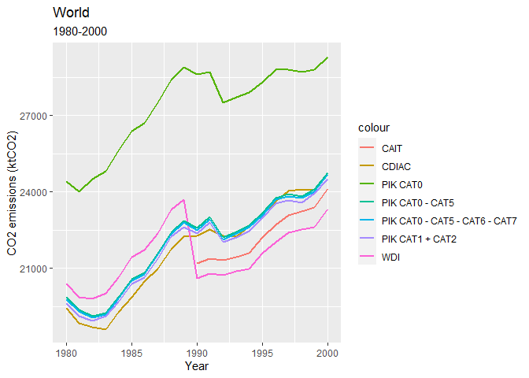
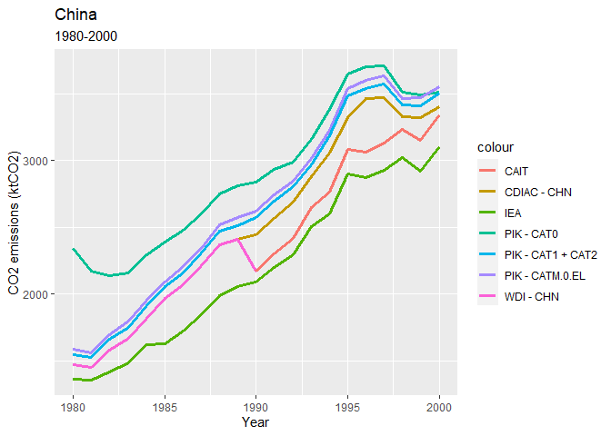
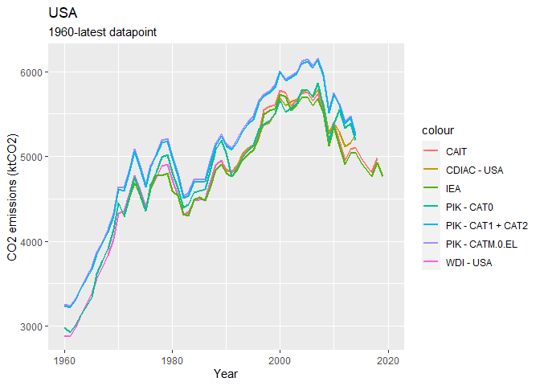
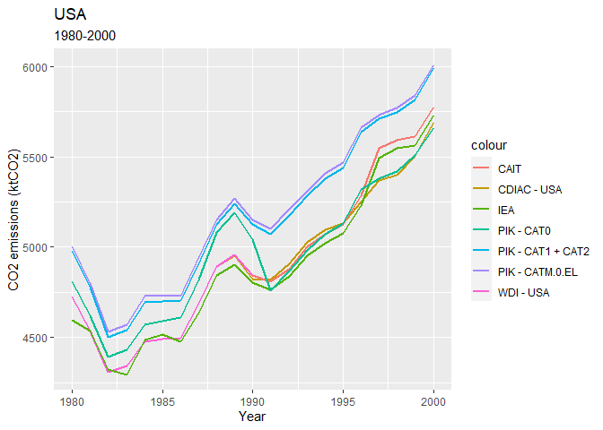
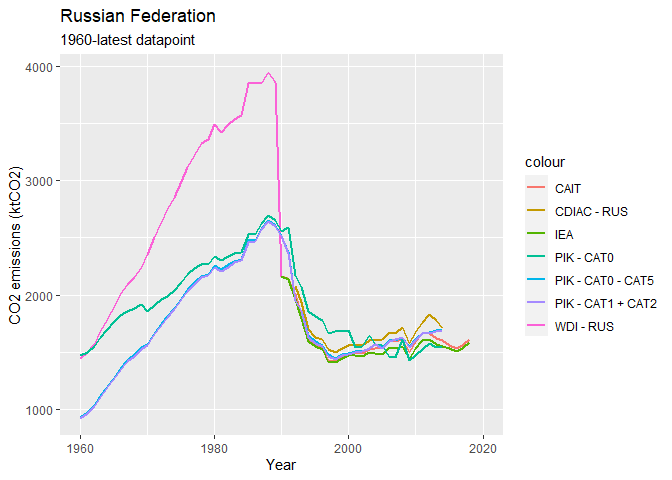
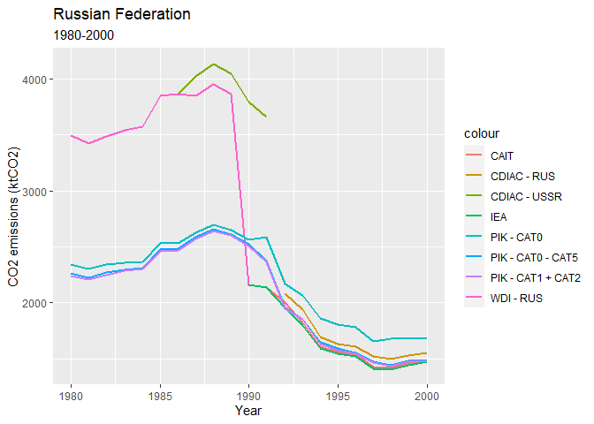

GHG emissions indicators in WDI
================

This note describes the current GHG indicators in the WDI and proposes a
new set of indicators using a different data source.

## Overview of GHG indicators currently included in WDI

The following GHG related indicators are currently in the WDI database:

Environment: Emissions section

<!-- | EN.ATM.PM25.MC.M3        | PM2.5 air pollution, mean annual exposure (micrograms per cubic meter) | -->
<!-- | EN.ATM.PM25.MC.T1.ZS | PM2.5 pollution, population exposed to levels exceeding WHO Interim Target-1 value (% of total) | -->
<!-- | EN.ATM.PM25.MC.T2.ZS | PM2.5 pollution, population exposed to levels exceeding WHO Interim Target-2 value (% of total) | -->
<!-- | EN.ATM.PM25.MC.T3.ZS | PM2.5 pollution, population exposed to levels exceeding WHO Interim Target-3 value (% of total) | -->
<!-- | EN.ATM.PM25.MC.ZS        | PM2.5 air pollution, population exposed to levels exceeding WHO guideline value (% of total) | -->

Other sections

| Series code       | Description                                 | Source | Time coverage |
|-------------------|---------------------------------------------|--------|---------------|
| EN.CLC.GHGR.MT.CE | GHG net emissions/removals by LUCF (MtCO2e) | UNFCCC | 1990 - 2009   |

<!-- | EN.CLC.ICER            | Issued Certified Emission Reductions (CERs) from CDM (thousands) || -->
<!-- | EN.CLC.IERU            | Issued Emission Reduction Units (ERUs) from JI (thousands) || -->
<!-- | EN.CLC.NCOM            | Latest UNFCCC national communication            || -->
<!-- EN.ATM.CO2E.KT - Carbon dioxide emissions are those stemming from the burning of fossil fuels and the manufacture of cement. They include carbon dioxide produced during consumption of solid, liquid, and gas fuels and gas flaring.  -->

## Definitions

### Kyoto basket greenhouse gases

| Code   | Description                                              |
|--------|----------------------------------------------------------|
| CO2    | Carbon Dioxide                                           |
| CH4    | Methane                                                  |
| FGASES | Fluorinated Gases (Hydrofluorocarbons + Perflurocarbons) |
| N2O    | Nitrous Oxide                                            |
| SF6    | Sulfur Hexafluoride                                      |

Global warming potentials : SAR / AR4 - e.g. Methane 21 vs. 25

### Category codes

Category descriptions using IPCC 1996 terminology.

| Code   | Description                                      |
|--------|--------------------------------------------------|
| 0      | National Total                                   |
| M.0.EL | National Total, excluding LULUCF                 |
| 1      | Total Energy                                     |
| 1.A    | Fuel Combustion Activities                       |
| 1.B    | Fugitive Emissions from Fuels                    |
| 2      | Industrial Processes                             |
| 3      | Solvent and Other Product Use                    |
| 4      | Agriculture                                      |
| 5      | Land Use, Land Use Change, and Forestry (LULUCF) |
| 6      | Waste                                            |
| 7      | Other                                            |

## Data sources

-   CDIAC - Carbon Dioxide Information analysis Center
    -   CO2 emissions from fossil-fuel burning, cement production, and
        gas flaring
    -   *URL* <https://cdiac.ess-dive.lbl.gov/trends/emis/meth_reg.html>
    -   *Time coverage*: data from 1751 until 2014
    -   *Countries*: \~180 (1960-1990), \~215 (1991-2014)
    -   *License*: <https://cdiac.ess-dive.lbl.gov/permission.html>
-   CAIT - Climate Analysis Indicators Tool (Climate Watch / World
    Resources Institute):
    -   all sectors and gases
    -   *URL*
        <https://www.climatewatchdata.org/ghg-emissions?end_year=2018&start_year=1990>
    -   *Time coverage*: data from 1990-2018
    -   *Countries*: 197 countries (parties to UNFCCC)
    -   *License*:
-   PIK PRIMAP - Potsdam Institute for Climate Impact Research
    -   All Kyoto GHGs by country, year and category
    -   *URL*
        <https://www.pik-potsdam.de/paris-reality-check/primap-hist/>,
        <https://dataservices.gfz-potsdam.de/pik/showshort.php?id=escidoc:4736895>
    -   *Time coverage*: data from 1850-2018 (check
        <https://zenodo.org/record/4479172#.YV765ZpNeUk> published in
        January 2021)
    -   *Countries*: 216 countries
    -   *License*: CC BY 4.0
-   GCP - Global Carbon Project:
    <https://www.icos-cp.eu/science-and-impact/global-carbon-budget/2018>
    -   CO2 emissions from fossil fuel combustion, cement production,
        and bunkers.
    -   *URL*
        <https://www.icos-cp.eu/science-and-impact/global-carbon-budget/2018>
    -   *Time coverage*: data from 1960-2018
    -   *Countries*: 229 countries and regions
    -   *License*:
-   IEA - International Energy Agency:
    -   *URL* <https://cdiac.ess-dive.lbl.gov/trends/emis/meth_reg.html>
    -   *Time coverage*: data from 1971-2018 (until 2019 for OECD
        countries)
    -   *Countries*: OECD countries, total 145 countries
    -   *License*:

### Data uncertainty

According to the Working Group III Contribution to the IPCC Fifth
Assessment Report, global CO2 emissions from fossil fuel combustion are
known within *8%* uncertainty (90% confidence interval). CO2 emissions
from FOLU (forestry and other land use) have very large uncertainties
associated with them in the order of *± 50%*. Uncertainty for global
emissions of CH4, N2O and the F-gases has been estimated as *20%*, *60%*
and *20%* respectively. For the PIK dataset, regional deforestation
emissions are downscaled to the country level using estimates of the
deforested area obtained from potential vegetation and calculations for
the needed agricultural land. Accordingly levels of uncertainty are
quite high for earlier years of data (closer to 1850).

## Proposal for WDI GHG emissions indicators

Source PIK

| Series code | Description |
|-------------|-------------|
|             |             |

List of indicators: \* Emissions by type in CO2e (CO2, methane, nitrous
oxide, fluorinated gases (SF6) + total) \* Emissions by
sector/categories – use IPCC 1996 categories \* Change from base year
1990 (own computation) \* Per capita emissions (only total?) (own
computation) \* Carbon intensity of economy (CO2e / GDP) (own
computation)

-   Concentration in atmosphere
-   Pathways

### Plotting data

Plotting data from different sources for CO2 emissions
<!-- --><!-- -->

<!-- --><!-- -->

<!-- --><!-- -->

How are values for the Russian Federation before 1992 computed? As share
of USSR? CDIAC lists Russia only starting 1992.

<!-- --><!-- -->

### Understanding differences

-   Different methodologies
-   Different categories
-   Different geographical boundaries

## Suggestions for GHG indicators

Choice of indicators depends on different factors:

-   Data availability (country coverage/time series)
-   Methodology used
-   Reliability of data
-   Relevance for development

## Questions

-   Factors used for computation of CO2e of other GHGs -> different
    factors used
-   Use extrapolated values for subset of countries for the years
    2016-2018

## Miscellaneous

-   Add more detail to description of series (e.g., )
-   Difference CAIT and PIK: CAIT doesn’t use official inventories
    reported UNFCCC, PIK does for countries where available
