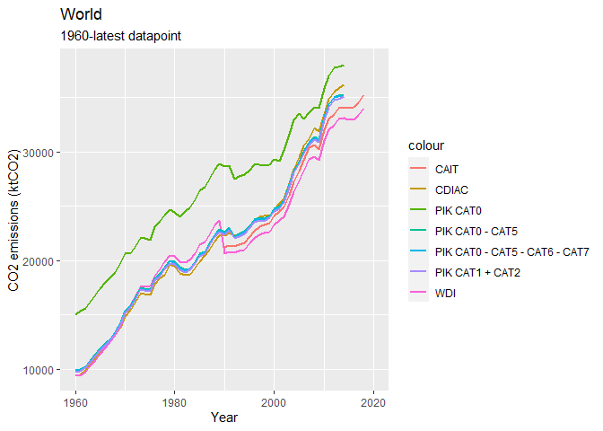
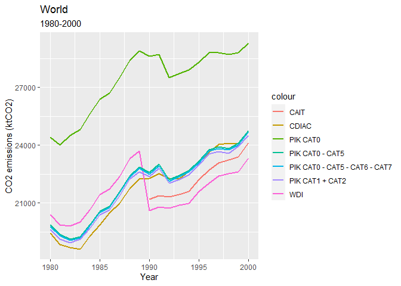
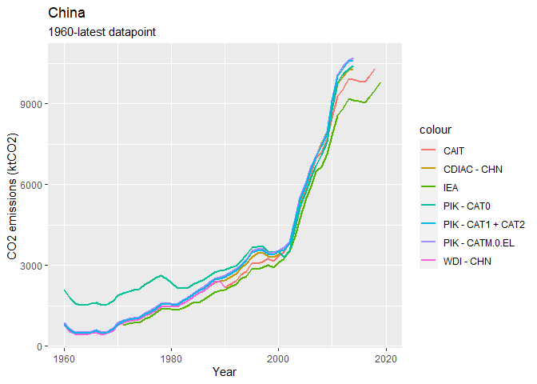
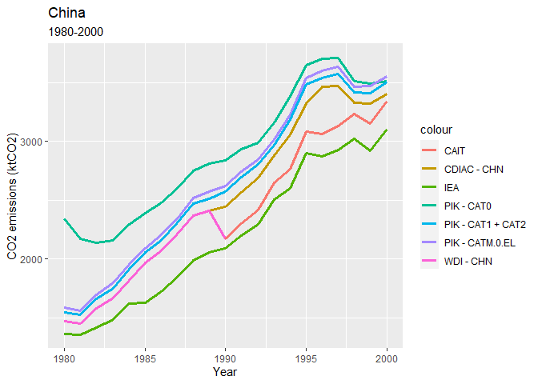
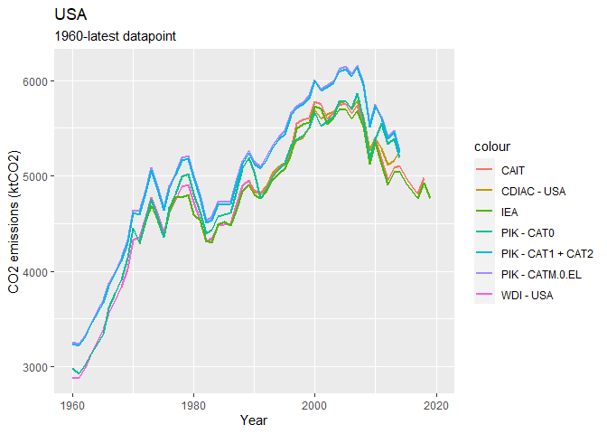
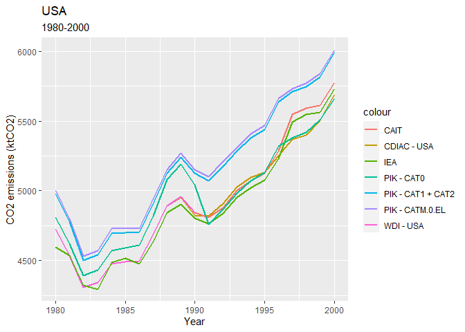
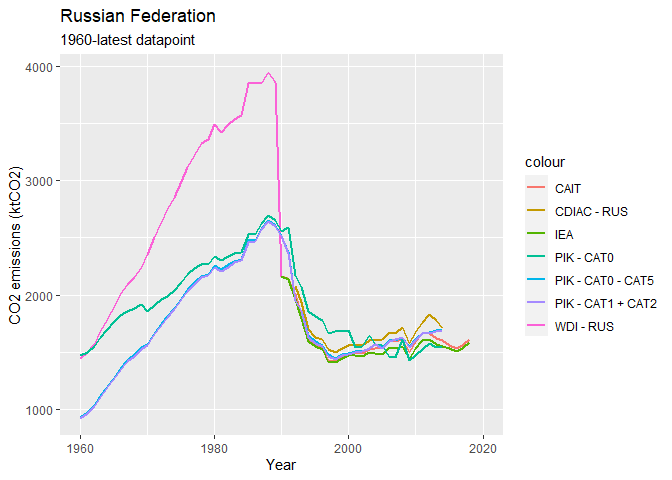
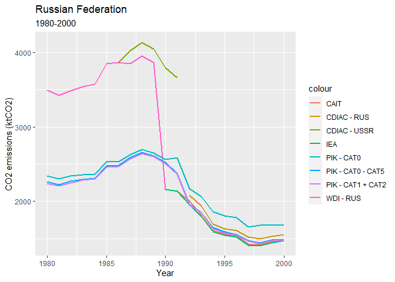

GHG emissions indicators in WDI
================

This note describes the current GHG indicators in the WDI and proposes a
new set of indicators using a different data source.

## Overview of GHG indicators currently included in WDI

The following GHG related indicators are currently in the WDI database:

Environment: Emissions section

``` r
kable(cur_indicators)
```

| Series code          | Description                                                                                                    | Source             | Time coverage          |
|:---------------------|:---------------------------------------------------------------------------------------------------------------|:-------------------|:-----------------------|
| EN.ATM.GHGT.KT.CE    | Total greenhouse gas emissions (thousand metric tons of CO2 equivalent excluding Land-Use Change and Forestry) | CDIAC / CAIT       | 1970-2018              |
| EN.ATM.GHGT.ZG       | Total greenhouse gas emissions (% change from 1990)                                                            | EDGAR (EC JRC/PBL) | 1991-2012              |
| EN.ATM.CO2E.KT       | Total CO2 emissions (thousand metric tons of CO2 excluding Land-Use Change and Forestry)                       | CDIAC / CAIT       | 1960-2018              |
| EN.ATM.CO2E.GF.KT    | CO2 emissions from gaseous fuel consumption (kt)                                                               | CDIAC              | 1960-2016              |
| EN.ATM.CO2E.GF.ZS    | CO2 emissions from gaseous fuel consumption (% of total)                                                       | CDIAC              | 1960-2016              |
| EN.ATM.CO2E.LF.KT    | CO2 emissions from liquid fuel consumption (kt)                                                                | CDIAC              | 1960-2016              |
| EN.ATM.CO2E.LF.ZS    | CO2 emissions from liquid fuel consumption (% of total)                                                        | CDIAC              | 1960-2016              |
| EN.ATM.CO2E.SF.KT    | CO2 emissions from solid fuel consumption (kt)                                                                 | CDIAC              | 1960-2016              |
| EN.ATM.CO2E.SF.ZS    | CO2 emissions from solid fuel consumption (% of total)                                                         | CDIAC              | 1960-2016              |
| EN.ATM.CO2E.EG.ZS    | CO2 intensity (kg per kg of oil equivalent energy use)                                                         | CDIAC              | 1990-2015              |
| EN.ATM.CO2E.PC       | CO2 emissions (metric tons per capita)                                                                         | CDIAC / CAIT       | 1960-2018              |
| EN.ATM.CO2E.KD.GD    | CO2 emissions (kg per 2010 US$ of GDP)                                                                         | CDIAC / CAIT       | 1960-2018              |
| EN.ATM.CO2E.PP.GD.KD | CO2 emissions (kg per 2017 PPP $ of GDP)                                                                       | CDIAC / CAIT (?)   | 1990-2018              |
| EN.ATM.CO2E.PP.GD    | CO2 emissions (kg per PPP $ of GDP)                                                                            | CDIAC / CAIT (?)   | 1990-2018              |
| EN.ATM.METH.AG.KT.CE | Agricultural methane emissions (thousand metric tons of CO2 equivalent)                                        | CDIAC / CAIT       | 1969-2018              |
| EN.ATM.METH.AG.ZS    | Agricultural methane emissions (% of total)                                                                    | EDGAR (EC JRC/PBL) | 1970-2008              |
| EN.ATM.METH.EG.KT.CE | Methane emissions in energy sector (thousand metric tons of CO2 equivalent)                                    | CDIAC / CAIT       | 1969-2018              |
| EN.ATM.METH.EG.ZS    | Energy related methane emissions (% of total)                                                                  | EDGAR (EC JRC/PBL) | 1970-2008              |
| EN.ATM.METH.KT.CE    | Total methane emissions (thousand metric tons of CO2 equivalent excluding Land-Use Change and Forestry)        | CDIAC / CAIT       | 1970-2018              |
| EN.ATM.METH.ZG       | Methane emissions (% change from 1990)                                                                         | EDGAR (EC JRC/PBL) | 1991-2012              |
| EN.ATM.NOXE.AG.KT.CE | Agricultural nitrous oxide emissions (thousand metric tons of CO2 equivalent)                                  | CDIAC / CAIT       | 1969-2018              |
| EN.ATM.NOXE.AG.ZS    | Agricultural nitrous oxide emissions (% of total)                                                              | EDGAR (EC JRC/PBL) | 1970-2008              |
| EN.ATM.NOXE.EG.KT.CE | Nitrous oxide emissions in energy sector (thousand metric tons of CO2 equivalent)                              | CDIAC / CAIT       | 1969-2018              |
| EN.ATM.NOXE.EG.ZS    | Nitrous oxide emissions in energy sector (% of total)                                                          | EDGAR (EC JRC/PBL) | 1970-2008              |
| EN.ATM.NOXE.KT.CE    | Total nitrous oxide emissions (thousand metric tons of CO2 equivalent excluding Land-Use Change and Forestry)  | CDIAC / CAIT       | 1970-2018              |
| EN.ATM.NOXE.ZG       | Nitrous oxide emissions (% change from 1990)                                                                   | EDGAR (EC JRC/PBL) | 1991-2012              |
| EN.ATM.HFCG.KT.CE    | HFC gas emissions (thousand metric tons of CO2 equivalent)                                                     | EDGAR (EC JRC/PBL) | 1990-2010 (not annual) |
| EN.ATM.PFCG.KT.CE    | PFC gas emissions (thousand metric tons of CO2 equivalent)                                                     | EDGAR (EC JRC/PBL) | 1990-2010 (not annual) |
| EN.ATM.SF6G.KT.CE    | SF6 gas emissions (thousand metric tons of CO2 equivalent)                                                     | EDGAR (EC JRC/PBL) | 1990-2010 (not annual) |
| EN.ATM.GHGO.KT.CE    | Other greenhouse gas emissions, HFC, PFC and SF6 (thousand metric tons of CO2 equivalent)                      | EDGAR (EC JRC/PBL) | 1970-2016 (not annual) |
| EN.ATM.GHGO.ZG       | Other greenhouse gas emissions (% change from 1990)                                                            | EDGAR (EC JRC/PBL) | 1991-2012              |

<!-- | EN.ATM.PM25.MC.M3        | PM2.5 air pollution, mean annual exposure (micrograms per cubic meter) | -->
<!-- | EN.ATM.PM25.MC.T1.ZS | PM2.5 pollution, population exposed to levels exceeding WHO Interim Target-1 value (% of total) | -->
<!-- | EN.ATM.PM25.MC.T2.ZS | PM2.5 pollution, population exposed to levels exceeding WHO Interim Target-2 value (% of total) | -->
<!-- | EN.ATM.PM25.MC.T3.ZS | PM2.5 pollution, population exposed to levels exceeding WHO Interim Target-3 value (% of total) | -->
<!-- | EN.ATM.PM25.MC.ZS        | PM2.5 air pollution, population exposed to levels exceeding WHO guideline value (% of total) | -->

Other sections

| Series code       | Description                                 | Source | Time coverage |
|-------------------|---------------------------------------------|--------|---------------|
| EN.CLC.GHGR.MT.CE | GHG net emissions/removals by LUCF (MtCO2e) | UNFCCC | 1990 - 2009   |

<!-- | EN.CLC.ICER            | Issued Certified Emission Reductions (CERs) from CDM (thousands) || -->
<!-- | EN.CLC.IERU            | Issued Emission Reduction Units (ERUs) from JI (thousands) || -->
<!-- | EN.CLC.NCOM            | Latest UNFCCC national communication            || -->
<!-- EN.ATM.CO2E.KT - Carbon dioxide emissions are those stemming from the burning of fossil fuels and the manufacture of cement. They include carbon dioxide produced during consumption of solid, liquid, and gas fuels and gas flaring.  -->

### Scoring of current indicators

``` r
# Load score_table current WDI GHG indicators
score_table_cur <- read.csv("current_WDI_indicators_scores.csv")
#colnames(score_table_cur)

kable(score_table_cur[, c("Indicator.Code", "hybrid_score_wgtd", "geographic_score_hybrid", "temporal_score_hybrid",
                          "completeness_score_hybrid", "usage_score_hybrid")])
```

| Indicator.Code       | hybrid_score_wgtd | geographic_score_hybrid | temporal_score_hybrid | completeness_score_hybrid | usage_score_hybrid |
|:---------------------|------------------:|------------------------:|----------------------:|--------------------------:|-------------------:|
| EN.ATM.CO2E.EG.ZS    |          3.160049 |                3.368120 |              2.803704 |                  3.440714 |           3.027657 |
| EN.ATM.CO2E.GF.KT    |          3.377966 |                3.458105 |              3.211111 |                  3.830286 |           3.012364 |
| EN.ATM.CO2E.GF.ZS    |          3.375166 |                3.458105 |              3.211111 |                  3.830286 |           3.001161 |
| EN.ATM.CO2E.KD.GD    |          3.331413 |                3.454071 |              3.211111 |                  3.640000 |           3.020468 |
| EN.ATM.CO2E.KT       |          3.449925 |                3.458105 |              3.211111 |                  3.830286 |           3.300200 |
| EN.ATM.CO2E.LF.KT    |          3.383786 |                3.458105 |              3.211111 |                  3.830286 |           3.035642 |
| EN.ATM.CO2E.LF.ZS    |          3.375545 |                3.458105 |              3.211111 |                  3.830286 |           3.002679 |
| EN.ATM.CO2E.PC       |          3.624554 |                3.458105 |              3.211111 |                  3.829000 |           4.000000 |
| EN.ATM.CO2E.PP.GD    |          3.353125 |                3.451489 |              2.988889 |                  3.900429 |           3.071693 |
| EN.ATM.CO2E.PP.GD.KD |          3.341344 |                3.428331 |              2.988889 |                  3.911286 |           3.036872 |
| EN.ATM.CO2E.SF.KT    |          3.376519 |                3.458105 |              3.211111 |                  3.830286 |           3.006574 |
| EN.ATM.CO2E.SF.ZS    |          3.378718 |                3.458105 |              3.211111 |                  3.830286 |           3.015369 |
| EN.ATM.GHGO.KT.CE    |          3.113615 |                3.435350 |              2.096131 |                  3.922571 |           3.000408 |
| EN.ATM.GHGO.ZG       |          2.813390 |                3.383272 |              1.940575 |                  3.999714 |           1.930000 |
| EN.ATM.GHGT.KT.CE    |          3.138202 |                3.445504 |              2.096131 |                  3.917143 |           3.094030 |
| EN.ATM.GHGT.ZG       |          3.081786 |                3.439323 |              1.940575 |                  3.928143 |           3.019101 |
| EN.ATM.HFCG.KT.CE    |          2.559285 |                3.162509 |              1.710614 |                  2.353000 |           3.011015 |
| EN.ATM.METH.AG.KT.CE |          3.067039 |                3.407000 |              1.850692 |                  4.000000 |           3.010463 |
| EN.ATM.METH.AG.ZS    |          3.069284 |                3.431237 |              1.843285 |                  3.993714 |           3.008901 |
| EN.ATM.METH.EG.KT.CE |          3.065645 |                3.407000 |              1.850692 |                  4.000000 |           3.004887 |
| EN.ATM.METH.EG.ZS    |          3.067312 |                3.431237 |              1.843285 |                  3.993714 |           3.001010 |
| EN.ATM.METH.KT.CE    |          3.138859 |                3.449149 |              2.096131 |                  3.980286 |           3.029871 |
| EN.ATM.METH.ZG       |          3.095823 |                3.431237 |              1.940575 |                  4.000000 |           3.011479 |
| EN.ATM.NOXE.AG.KT.CE |          3.065075 |                3.407000 |              1.850692 |                  4.000000 |           3.002610 |
| EN.ATM.NOXE.AG.ZS    |          3.065909 |                3.423860 |              1.843285 |                  3.993714 |           3.002779 |
| EN.ATM.NOXE.EG.KT.CE |          2.896090 |                3.407000 |              1.850692 |                  4.000000 |           2.326667 |
| EN.ATM.NOXE.EG.ZS    |          2.846881 |                3.423860 |              1.843285 |                  3.993714 |           2.126667 |
| EN.ATM.NOXE.KT.CE    |          3.148933 |                3.442105 |              2.096131 |                  3.980429 |           3.077068 |
| EN.ATM.NOXE.ZG       |          3.091339 |                3.423860 |              1.940575 |                  4.000000 |           3.000922 |
| EN.ATM.PFCG.KT.CE    |          2.376531 |                3.162509 |              1.710614 |                  2.353000 |           2.280000 |
| EN.ATM.SF6G.KT.CE    |          2.556630 |                3.162509 |              1.710614 |                  2.353000 |           3.000395 |

### Issues with current data sources/indicators

GHG indicators combine two different sources, that create a jump in the
series due to different methodologies used in the two series.
Furthermore, the current series are more volatile and the volatility
does not always have explaining factors. Volatility partially occurs
because of the way the series is compiled by CAIT. CAIT (and other
sources) compile their series using different primary sources. The
sources can be broadly divided into country-reported data and
third-party data. Differences between these two sources can be large and
CAIT fills missing data from one source with missing data from another
sources, which explains in part the observed volatility in the data.
CAIT does not use official inventories reported to UNFCCC, PIK does for
countries where available.

## Definitions

### Kyoto basket greenhouse gases

| Code   | Description                                              |
|--------|----------------------------------------------------------|
| CO2    | Carbon Dioxide                                           |
| CH4    | Methane                                                  |
| FGASES | Fluorinated Gases (Hydrofluorocarbons + Perflurocarbons) |
| N2O    | Nitrous Oxide                                            |
| SF6    | Sulfur Hexafluoride                                      |

### Global warming potentials

Global Warming Potentials (GWP) are the factors used to convert other
GHGs into CO2e to make them comparable w.r.t. the effect on global
warming. GWP is a measure of how much energy the emissions of 1 ton of a
gas will absorb over a given period of time, relative to the emissions
of 1 ton of carbon dioxide (CO2). GWPs are estimates and different sets
of GWPs are used. We use the GWPs from the fourth IPCC assessment
report:

| GHG | GWP |
|-----|-----|
| CO2 | 1   |
| CH4 | 25  |
| N2O | 298 |

### Category codes

Category descriptions using IPCC 1996 terminology.

| Code   | Description                                      |
|--------|--------------------------------------------------|
| 0      | National Total                                   |
| M.0.EL | National Total, excluding LULUCF                 |
| 1      | Total Energy                                     |
| 1.A    | Fuel Combustion Activities                       |
| 1.B    | Fugitive Emissions from Fuels                    |
| 2      | Industrial Processes                             |
| 3      | Solvent and Other Product Use                    |
| 4      | Agriculture                                      |
| 5      | Land Use, Land Use Change, and Forestry (LULUCF) |
| 6      | Waste                                            |
| 7      | Other                                            |

Data on LULUCF has high uncertainty and we therefore exlcude.

## Data sources for GHG

All sources rely on the same primary sources for data.

-   PIK PRIMAP - Potsdam Institute for Climate Impact Research
    -   All Kyoto GHGs by country, year and category
    -   *URL* <https://zenodo.org/record/5494497#.YZJPvmC0uUk>
    -   *Time coverage*: data from 1850-2019 (check
        <https://zenodo.org/record/4479172#.YV765ZpNeUk> published in
        September 2021)
    -   *Countries*: 216 countries
    -   *License*: CC BY 4.0
-   CDIAC - Carbon Dioxide Information analysis Center
    -   CO2 emissions from fossil-fuel burning, cement production, and
        gas flaring
    -   *URL* <https://cdiac.ess-dive.lbl.gov/trends/emis/meth_reg.html>
    -   *Time coverage*: data from 1751 until 2014
    -   *Countries*: \~180 (1960-1990), \~215 (1991-2014)
    -   *License*: <https://cdiac.ess-dive.lbl.gov/permission.html>
-   CAIT - Climate Analysis Indicators Tool (Climate Watch / World
    Resources Institute):
    -   all sectors and gases
    -   *URL*
        <https://www.climatewatchdata.org/ghg-emissions?end_year=2018&start_year=1990>
    -   *Time coverage*: data from 1990-2018
    -   *Countries*: 197 countries (parties to UNFCCC)
    -   *License*:
-   GCP - Global Carbon Project:
    <https://www.icos-cp.eu/science-and-impact/global-carbon-budget/2018>
    -   CO2 emissions from fossil fuel combustion, cement production,
        and bunkers.
    -   *URL*
        <https://www.icos-cp.eu/science-and-impact/global-carbon-budget/2018>
    -   *Time coverage*: data from 1960-2018
    -   *Countries*: 229 countries and regions
    -   *License*:
-   IEA - International Energy Agency:
    -   *URL* <https://cdiac.ess-dive.lbl.gov/trends/emis/meth_reg.html>
    -   *Time coverage*: data from 1971-2018 (until 2019 for OECD
        countries)
    -   *Countries*: OECD countries, total 145 countries
    -   *License*:

### Data uncertainty

According to the Working Group III Contribution to the IPCC Fifth
Assessment Report, global CO2 emissions from fossil fuel combustion are
known within *8%* uncertainty (90% confidence interval). CO2 emissions
from FOLU (forestry and other land use) have very large uncertainties
associated with them in the order of *± 50%*. Uncertainty for global
emissions of CH4, N2O and the F-gases has been estimated as *20%*, *60%*
and *20%* respectively. For the PIK dataset, regional deforestation
emissions are downscaled to the country level using estimates of the
deforested area obtained from potential vegetation and calculations for
the needed agricultural land. Accordingly levels of uncertainty are
quite high for earlier years of data (closer to 1850).

## Proposal for WDI GHG emissions indicators

### Temporal coverage

The dataset covers the years 1750-2019, where a considerable number of
values 2019 are numerically extrapolated. As the WDI starts in 1960,
only values from 1960 are considered.

### Country coverage

The WDI includes 217 of which 198 are included in the PIK dataset. The
following WDI countries are not included in the PIK dataset:

| long_name                 | ISO3 |
|:--------------------------|:-----|
| American Samoa            | ASM  |
| Bermuda                   | BMU  |
| Cayman Islands            | CYM  |
| Channel Islands           | CHI  |
| Curacao                   | CUW  |
| Faroe Islands             | FRO  |
| French Polynesia          | PYF  |
| Gibraltar                 | GIB  |
| Greenland                 | GRL  |
| Guam                      | GUM  |
| Isle of Man               | IMN  |
| Kosovo                    | XKX  |
| New Caledonia             | NCL  |
| Northern Mariana Islands  | MNP  |
| Puerto Rico               | PRI  |
| Sint Maarten (Dutch part) | SXM  |
| St. Martin (French part)  | MAF  |
| Virgin Islands (U.S.)     | VIR  |
| West Bank and Gaza        | PSE  |

### New indicators

### Scores of new indicators

List of indicators: \* Emissions by type in CO2e (CO2, methane, nitrous
oxide, fluorinated gases (SF6) + total) \* Emissions by
sector/categories – use IPCC 1996 categories \* Change from base year
1990 (own computation) \* Per capita emissions (only total?) (own
computation) \* Carbon intensity of economy (CO2e / GDP) (own
computation)

-   Concentration in atmosphere
-   Pathways

## Decisions to make

### Sectors / GHG combinations

Some sector/GHG combinations are not common as not all gases are
produced in each sector. Therefore, some combinations could be dropped
or keep all

Proposal:

### Third-party data vs. country-reported data

PIK published two main series: one that relies on third-party data and
another that relies on country-reported data. The third-party data is a
smoother series.

Proposal: use third-party data

### Units

Convert all GHG data into CO2e for comparison or report in tons of
respective GHG

Proposal:

### Extrapolated values

Use extrapolated values for latest year for some countries or keep
missing values

### Plotting data

Plotting data from different sources for CO2 emissions
<!-- --><!-- -->

<!-- --><!-- -->

<!-- --><!-- -->

How are values for the Russian Federation before 1992 computed? As share
of USSR? CDIAC lists Russia only starting 1992.

<!-- --><!-- -->

### Understanding differences

-   Different methodologies
-   Different categories
-   Different geographical boundaries

## Suggestions for GHG indicators

Choice of indicators depends on different factors:

-   Data availability (country coverage/time series)
-   Methodology used
-   Reliability of data
-   Relevance for development

## Questions
