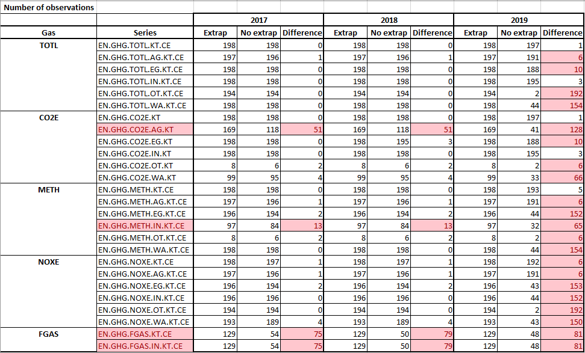

```{r setup, include=FALSE}
knitr::opts_chunk$set(echo = TRUE)

# Load packages
library(ggplot2)
library(dplyr)
library(knitr)
library(readxl)
library(data.table)
library(ggplot2)
library(dplyr)
library(readxl)
library(ggrepel)
library(plotly)
library(knitr)
library(htmltools)
library(data.tree)
library(DiagrammeR)

setwd("C:/Users/wb460271/OneDrive - WBG/Documents/GitHub/WDI_GHG_emissions")

####### Read data ####### 
## PIK, downloaded from https://zenodo.org/record/5494497#.YZJPvmC0uUk # v.2.3.1 (1750-2019)
# Gütschow, J.; Günther, A.; Pflüger, M. (2021): The PRIMAP-hist national historical emissions time series v2.3.1 (1850-2019). zenodo. doi:`10.5281/zenodo.5494497`.
PIK <- as.data.table(read.csv("./Data_private/PIK/Guetschow-et-al-2021-PRIMAP-hist_v2.3.1_20-Sep_2021.csv"))
#PIK <- as.data.table(read.csv("./Data_private/PIK/PRIMAP-hist_v1.1_06-Mar-2017.csv"))
setnames(PIK, "scenario..PRIMAP.hist.", "scenario")

# Read spreadsheets
cur_indicators <- read_xlsx("current_WDI_indicators.xlsx")
new_indicators <- read_xlsx("./Data/new_indicators.xlsx")
```

This note describes the current GHG indicators in the WDI and proposes a new set of indicators using a different data source. 

## Overview of GHG indicators currently included in WDI

The following 37 GHG related indicators are currently in the WDI database:

```{r display_cur_indicators, fig.width=12, echo=FALSE, results = 'asis'}
kable(cur_indicators)

cur_indicators$pathString <- paste("WDI GHG Indicators", 
                                   cur_indicators$GHG, 
                                   cur_indicators$Sector, 
                                   cur_indicators$`Series code`,
                                   cur_indicators$Description,
                                   sep = "/")

cur_indicators_tree <- as.Node(cur_indicators)

#print(cur_indicators_tree) #, "Description", "Source", "Time coverage")

SetGraphStyle(cur_indicators_tree, rankdir = "LR") # left-right

fontsizenew = 24

SetEdgeStyle(cur_indicators_tree, arrowhead = "vee", color = "grey35", penwidth = 2, fontsize = fontsizenew)

SetNodeStyle(cur_indicators_tree, style = "filled,rounded", shape = "box", fillcolor = "White", 
             fontname = "helvetica", tooltip = GetDefaultTooltip, fontsize = fontsizenew)
SetNodeStyle(cur_indicators_tree$All, fillcolor = "LightBlue", penwidth = "2px", fontcolor = "black", fontsize = fontsizenew)
SetNodeStyle(cur_indicators_tree$CO2, fillcolor = "Orange", penwidth = "2px", fontcolor = "black", fontsize = fontsizenew)
SetNodeStyle(cur_indicators_tree$CH4, fillcolor = "Yellow", penwidth = "2px", fontcolor = "black", fontsize = fontsizenew)
SetNodeStyle(cur_indicators_tree$N2O, fillcolor = "Pink", penwidth = "2px", fontcolor = "black", fontsize = fontsizenew)
SetNodeStyle(cur_indicators_tree$`Fluorinated gases`, fillcolor = "GreenYellow", penwidth = "2px", fontcolor = "black", fontsize = fontsizenew)

#SetNodeStyle(cur_indicators_tree$Other, fillcolor = "GreenYellow", penwidth = "2px", fontcolor = "black", fontsize = fontsizenew)
```

Breakdown of current indicators by GHG and sector

```{r display_cur_indicators_by_GHG_sector, fig.width=12, echo=FALSE, results = 'asis'}
plot(cur_indicators_tree)
```

```{r display_cur_indicators_2, out.width = '300%', echo=FALSE, results = 'asis'}
#SetGraphStyle(cur_indicators_tree, rankdir = "TP") # top-bottom
#plot(cur_indicators_tree)
```

<!-- | EN.ATM.PM25.MC.M3	    | PM2.5 air pollution, mean annual exposure (micrograms per cubic meter) | -->
<!-- | EN.ATM.PM25.MC.T1.ZS	| PM2.5 pollution, population exposed to levels exceeding WHO Interim Target-1 value (% of total) | -->
<!-- | EN.ATM.PM25.MC.T2.ZS	| PM2.5 pollution, population exposed to levels exceeding WHO Interim Target-2 value (% of total) | -->
<!-- | EN.ATM.PM25.MC.T3.ZS	| PM2.5 pollution, population exposed to levels exceeding WHO Interim Target-3 value (% of total) | -->
<!-- | EN.ATM.PM25.MC.ZS	    | PM2.5 air pollution, population exposed to levels exceeding WHO guideline value (% of total) | -->

<!-- Other sections -->

<!-- | Series code           | Description                                     | Source                        | Time coverage | -->
<!-- | --------------------- | ----------------------------------------------- | ----------------------------- | ------------- | -->
<!-- | EN.CLC.GHGR.MT.CE	    | GHG net emissions/removals by LUCF (MtCO2e)     | UNFCCC                        | 1990 - 2009   | -->
<!-- | EN.CLC.ICER	          | Issued Certified Emission Reductions (CERs) from CDM (thousands) || -->
<!-- | EN.CLC.IERU	          | Issued Emission Reduction Units (ERUs) from JI (thousands) || -->
<!-- | EN.CLC.NCOM	          | Latest UNFCCC national communication            || -->

<!-- EN.ATM.CO2E.KT - Carbon dioxide emissions are those stemming from the burning of fossil fuels and the manufacture of cement. They include carbon dioxide produced during consumption of solid, liquid, and gas fuels and gas flaring.  -->

### Scoring of current indicators

Using hybrid scoring considering time and country coverage and usage statistics ranging between 0 (worst) and 4 (best).

```{r display_scoring_cur_indicators, echo=FALSE, results = 'asis'}

# Load score_table current WDI GHG indicators
score_table_cur <- read.csv("current_WDI_indicators_scores_2.csv")
#colnames(score_table_cur)

kable(score_table_cur[, c("Indicator.Code", "hybrid_score_wgtd", "geographic_score_hybrid", "temporal_score_hybrid",
                          "completeness_score_hybrid", "usage_score_hybrid")])
```

Time and country coverage of existing indicators showing that latest year of many indicators is 2014 or 2018 and country coverage is low for some indicators.

```{r display_coverage, echo=FALSE, results = 'asis'}
# from environment gap analysis

data_count <- as.data.table(read.csv("data_count_env.csv"))

p <-  data_count %>% 
      filter(Year >= 2000, Year <= 2020, Indicator.Code %in% cur_indicators$`Series code`) %>%
      ggplot(aes(x = Year,
                 y = Indicator.Code,
                 text = Indicator.Name, 
                 fill = count)) +
      geom_tile() +
  scale_fill_viridis_c(option = "A", alpha = .8,
                       limits = c(0, 220),
                       breaks = c(0, 50, 100, 150, 200)) +
  labs(x = "", y = "") +
  scale_x_continuous(breaks = c(2000:2020),
                     # leaves some padding on either side of the heatmap - necessary for PDF versions
                     limits=c(1999,2021),
                     expand = c(0,0)) +
  theme(axis.text.x = element_text(size = rel(0.8), angle = 330, hjust = 0, colour = "grey50"),
        axis.text.y = element_text(size = rel(0.5), colour = "grey50")) 
   
  ggplotly(p) # for html_output
  #p # for github_document  

#render_table_coverage
```


### Issues with current data sources/indicators
GHG indicators combine two different sources, that create a jump in the series due to different methodologies used in the two series. Furthermore, the current series are more volatile and the volatility does not always have explaining factors. Volatility partially occurs because of the way the series is compiled by CAIT. CAIT (and other sources) compile their series using different primary sources. The sources can be broadly divided into country-reported data and third-party data. Differences between these two sources can be large and CAIT fills missing data from one source with missing data from another sources, which explains in part the observed volatility in the data. CAIT does not use official inventories reported to UNFCCC, PIK does for countries where available.

Licensing issues and data availability: indicators from IEA are distributed under a license that restricts redistribution and only available until 2014.

The official SDG indicators on GHG emissions are INDICATOR 9.4.1 CO2 emission per unit of value added and 
INDICATOR 13.2.2 Total greenhouse gas emissions per year (https://unstats.un.org/sdgs/dataportal/database). 
also licensing terms and SDGs. The respective sources are UNIDO and UNFCCC. Indicator 9.4.1 does not reflect 

```{r plot_WLD, echo=FALSE, warning= FALSE}
combined_sources <- readRDS("Data/data_for_plots/combined_sources.rds")

ggplot(data=combined_sources %>% filter(Year >= 1960), aes(Year)) +
  geom_line(aes(y = WORLD_CAIT, colour = "CAIT"), size = 1)+
  geom_line(aes(y = WORLD_CDIAC, colour = "CDIAC"), size = 1)+
  geom_line(aes(y = WORLD_WDI, colour = "WDI"), size = 1) +
  geom_line(aes(y = CAT0/1000, colour = "PIK CAT0"), size = 1) +
  #geom_line(aes(y = WORLD_PIK_1, colour = "PIK CAT0 - CAT5"), size = 1) +
  #geom_line(aes(y = WORLD_PIK_2, colour = "PIK CAT0 - CAT5 - CAT6 - CAT7"), size = 1) +
  #geom_line(aes(y = (CAT1 + CAT2)/1000, colour = "PIK CAT1 + CAT2"), size = 1) +
  labs(x = "Year", y= "CO2 emissions (ktCO2)", title = "World", subtitle = "1960-latest datapoint")

```


```{r plot_CHN, echo=FALSE, warning= FALSE}
combined_sources_CHN <- readRDS("Data/data_for_plots/combined_sources_CHN.rds")

## China
ggplot(data=combined_sources_CHN %>% filter(Year >= 1960), aes(Year)) +
  geom_line(aes(y = CDIAC_CHN, colour = "CDIAC - CHN"), size = 1)+
  geom_line(aes(y = WDI_CHN, colour = "WDI - CHN"), size = 1) +
  geom_line(aes(y = CAIT_CHN, colour = "CAIT"), size = 1) +
  geom_line(aes(y = IEA_CHN, colour = "IEA"), size = 1) +
  #geom_line(aes(y = CAT0/1000, colour = "PIK - CAT0"), size = 1) +
  geom_line(aes(y = CHN_PIK, colour = "PIK - CATM.0.EL"), size = 1) +
  #geom_line(aes(y = (CAT1 + CAT2)/1000, colour = "PIK - CAT1 + CAT2"), size = 1) +
  labs(x = "Year", y= "CO2 emissions (ktCO2)", title = "China", subtitle = "1960-latest datapoint")

```


```{r plot_USA, echo=FALSE, warning= FALSE}
combined_sources_USA <- readRDS("Data/data_for_plots/combined_sources_USA.rds")
ggplot(data=combined_sources_USA %>% filter(Year >= 1960), aes(Year)) +
  geom_line(aes(y = CDIAC_USA , colour = "CDIAC - USA"), size = 1)+
  geom_line(aes(y = WDI_USA , colour = "WDI - USA"), size = 1) +
  geom_line(aes(y = CAIT_USA, colour = "CAIT"), size = 1) +
  geom_line(aes(y = IEA_USA, colour = "IEA"), size = 1) +
  #geom_line(aes(y = CAT0/1000, colour = "PIK - CAT0"), size = 1) +
  geom_line(aes(y = USA_PIK, colour = "PIK - CATM.0.EL"), size = 1) +
  #geom_line(aes(y = (CAT1 + CAT2)/1000, colour = "PIK - CAT1 + CAT2"), size = 1) +
  labs(x = "Year", y= "CO2 emissions (ktCO2)", title = "USA", subtitle = "1960-latest datapoint") #+

```

```{r plot_RUS, echo=FALSE, warning= FALSE}
combined_sources_RUS <- readRDS("Data/data_for_plots/combined_sources_RUS.rds")

ggplot(data=combined_sources_RUS %>% filter(Year >= 1960), aes(Year)) +
  geom_line(aes(y = CDIAC_RUS , colour = "CDIAC - RUS"), size = 1)+
  geom_line(aes(y = WDI_RUS , colour = "WDI - RUS"), size = 1) +
  geom_line(aes(y = CAIT_RUS, colour = "CAIT"), size = 1) +
  geom_line(aes(y = IEA_RUS, colour = "IEA"), size = 1) +
  geom_line(aes(y = CAT0/1000, colour = "PIK - CAT0"), size = 1) +
 # geom_line(aes(y = RUS_PIK, colour = "PIK - CAT0 - CAT5"), size = 1) +
  #geom_line(aes(y = (CAT1 + CAT2)/1000, colour = "PIK - CAT1 + CAT2"), size = 1) +
  labs(x = "Year", y= "CO2 emissions (ktCO2)", title = "Russian Federation", subtitle = "1960-latest datapoint")

```

```{r plot_trend_break, include = FALSE}
# Convert data in long format
setnames(PIK, "category..IPCC2006_PRIMAP.", "category")
setnames(PIK, "area..ISO3.", "ISO3")
PIK_long <- melt(PIK, id.vars = c("source", "ISO3", "entity", "unit", "category", "scenario"),
                 variable.name = "year", value.factor = FALSE, variable.factor = FALSE)
PIK_long[, year := as.numeric(substring(year, 2, 5))]
#dim(PIK_long)
PIK_long <- PIK_long[year >= 1960, ] # only keep if year >= 1960
PIK_long[, value := value / 1000] # convert to Mt CO2e

## CAIT data for comparison
CAIT <- as.data.table(read_xlsx("Data_private/CAIT/ghg-emissions/CW_CAIT_GHG_Emissions.xlsx"))
#CAIT

CAIT_long <- melt(CAIT, id.vars = c("Country", "Source", "Sector", "Gas"))
setnames(CAIT_long, "value", "CO2_emissions_ktCO2")
setnames(CAIT_long, "variable", "Year")
CAIT_long[, Source := NULL]
CAIT_long[, Year := as.numeric(as.character(Year))] # convert year to numeric

CAIT_wide <- dcast(data = CAIT_long %>% filter(Sector == "Total excluding LUCF" & Gas == "CO2"), #  & Gas == "All GHG"
                   formula = Year ~ Country,
                   value.var = "CO2_emissions_ktCO2")
#class(CAIT_wide$Year)
CAIT_wide[, Year := as.numeric(as.character((Year)))]

all_ISO3 <- intersect(unique(PIK_long$ISO3), unique(CAIT_long$Country)) # c("RUS", "NLD")

##### Plot series for each country #####
plot_function <- function(cur_ISO3){
  #cur_ISO3 <- "RUS"
  
  # Select only current country
  cur_PIK_long <- PIK_long %>% filter(ISO3 == cur_ISO3)
  
  # Reshape to wide
  cur_PIK_wide <- cur_PIK_long %>% select(-unit) %>% 
    dcast(formula = ... ~ entity + scenario + category) 
  #cur_PIK_wide
  
  # Add CAIT data
  cur_CAIT_wide <- CAIT_long %>% 
    mutate(Sector = gsub(" ", "", Sector)) %>% # remove white spaces in sector names
    filter(Country == cur_ISO3) %>% 
    dcast(formula = ... ~ Gas + Sector, value.var = "CO2_emissions_ktCO2") %>%
    rename(year = Year, ISO3 = Country)
  
  #sapply(cur_CAIT_wide, class)
  #sapply(cur_PIK_wide, class)
  
  cur_combined_wide <- merge(cur_CAIT_wide, cur_PIK_wide, by = c("ISO3", "year"), all.y = TRUE)
  dim(cur_combined_wide)
  
  cur_fig <- plot_ly(cur_combined_wide, x = ~year, y = ~CO2_HISTCR_M.0.EL, 
                     name = 'PIK - HISTCR M.0.EL', type = 'scatter', mode = 'lines') %>% 
    add_trace(y = ~CO2_HISTTP_M.0.EL, name = 'PIK - HISTTP M.0.EL', mode = 'lines') %>%
    add_trace(y = ~CO2_TotalexcludingLUCF, name = 'CAIT - CO2_Total excluding LUCF', mode = 'lines') %>%
  layout(title = cur_ISO3, yaxis = list(title = list(text ='CO2 emissions (Mt CO2)')))
  
  print(cur_fig)
  #htmltools::tagList(plots)
}


```

```{r plot_volatility, include = FALSE}

plot_function("ATG")
plot_function("BRB")
plot_function("LCA")

```

## Definitions

### Kyoto basket greenhouse gases

| Code   | Description                                      |
| ------ | ------------------------------------------------ |
| CO2 | Carbon Dioxide |
| CH4 | Methane |
| FGASES | Fluorinated Gases (Hydrofluorocarbons + Perflurocarbons) |
| N2O | Nitrous Oxide |
| SF6 | Sulfur Hexafluoride |

### Global warming potentials 
Global Warming Potentials (GWP) are the factors used to convert other GHGs into CO2e to make 
them comparable w.r.t. the effect on global warming. GWP is a measure of how much 
energy the emissions of 1 ton of a gas will absorb over a given period of time, 
relative to the emissions of 1 ton of carbon dioxide (CO2). GWPs are estimates 
and different sets of GWPs are used. We use the GWPs from the fourth IPCC assessment report:

| GHG   | GWP                                      |
| ------ | ------------------------------------------------ |
| CO2 | 1 |
| CH4 | 25 |
| N2O | 298 |

### Category codes

Category descriptions using IPCC 1996 terminology.

| Code   | Description                                      |
| ------ | ------------------------------------------------ |
| 0      | National Total                                   |
| M.0.EL | National Total, excluding LULUCF                 |
| 1      | Total Energy                                     |
| 1.A    | Fuel Combustion Activities                       |
| 1.B    | Fugitive Emissions from Fuels                    |
| 2      | Industrial Processes                             |
| 3      | Solvent and Other Product Use                    |
| 4      | Agriculture                                      |
| 5      | Land Use, Land Use Change, and Forestry (LULUCF) |
| 6      | Waste                                            |
| 7      | Other                                            |

Data on LULUCF has high uncertainty and we therefore exlcude.

## Data sources for GHG
All sources rely on the same primary sources for data.

* PIK PRIMAP - Potsdam Institute for Climate Impact Research
  + All Kyoto GHGs by country, year and category
  + *URL* https://zenodo.org/record/5494497#.YZJPvmC0uUk
  + *Time coverage*: data from 1850-2019 (check https://zenodo.org/record/4479172#.YV765ZpNeUk published in September 2021)
  + *Countries*: 216 countries
  + *License*: CC BY 4.0
* CDIAC - Carbon Dioxide Information analysis Center
  + CO2 emissions from fossil-fuel burning, cement production, and gas flaring
  + *URL* https://cdiac.ess-dive.lbl.gov/trends/emis/meth_reg.html
  + *Time coverage*: data from 1751 until 2014
  + *Countries*: ~180 (1960-1990), ~215 (1991-2014)
  + *License*: https://cdiac.ess-dive.lbl.gov/permission.html
* CAIT - Climate Analysis Indicators Tool (Climate Watch / World Resources Institute): 
  + all sectors and gases
  + *URL* https://www.climatewatchdata.org/ghg-emissions?end_year=2018&start_year=1990 
  + *Time coverage*: data from 1990-2018
  + *Countries*: 197 countries (parties to UNFCCC)
  + *License*: 
* GCP - Global Carbon Project: https://www.icos-cp.eu/science-and-impact/global-carbon-budget/2018
  + CO2 emissions from fossil fuel combustion, cement production, and bunkers.
  + *URL* https://www.icos-cp.eu/science-and-impact/global-carbon-budget/2018
  + *Time coverage*: data from 1960-2018 
  + *Countries*: 229 countries and regions
  + *License*: 
* IEA - International Energy Agency: 
  + *URL* https://cdiac.ess-dive.lbl.gov/trends/emis/meth_reg.html
  + *Time coverage*: data from 1971-2018 (until 2019 for OECD countries)
  + *Countries*: OECD countries, total 145 countries
  + *License*: 
  
### Data uncertainty
According to the Working Group III Contribution to the IPCC Fifth Assessment Report, global CO2 emissions from fossil fuel combustion are known within *8%* uncertainty (90% confidence interval). CO2 emissions from FOLU (forestry and other land use) have very large uncertainties associated with them in the order of *± 50%*. Uncertainty for global emissions of CH4, N2O and the F-gases has been estimated as *20%*, *60%* and *20%* respectively. For the PIK dataset, regional deforestation emissions are downscaled to the country level using estimates of the deforested area obtained from potential vegetation and calculations for the needed agricultural land. Accordingly levels of uncertainty are quite high for earlier years of data (closer to 1850).

## Proposal for WDI GHG emissions indicators

### Temporal coverage
The dataset covers the years 1750-2019, where a considerable number of values 2019 are numerically extrapolated. As the WDI starts in 1960, only values from 1960 are considered.

### Country coverage
```{r country_coverage, include=FALSE}
# Check which WDI countries available
# Load country WDI list (217 countries)
WDI_countries <- as.data.table(read.csv("Data/wdi_country_list.csv"))
setnames(WDI_countries, c("long_name", "ISO3"))

PIK_countries <- unique(PIK$ISO3) # unique(PIK$area..ISO3.)
length(PIK_countries) # 215 countries
table(WDI_countries$ISO3 %in% PIK_countries) # 198 WDI countries available in PIK
WDI_countries[!(ISO3 %in% PIK_countries)] # list of missing countries
table(PIK_countries %in% WDI_countries$ISO3)
PIK_countries[!(PIK_countries %in% WDI_countries$ISO3)] # list of missing countries

# Drop countries/regions not in WDI
PIK <- PIK[ISO3 %in% WDI_countries$ISO3]
#PIK <- PIK[area..ISO3. %in% WDI_countries$ISO3]

# Rename variables
colnames(PIK)
#setnames(PIK, c("area..ISO3.", "category..IPCC2006_PRIMAP."),
#         c("ISO3", "category"))
```

The WDI includes `r nrow(WDI_countries)` of which `r sum(WDI_countries$ISO3 %in% PIK_countries)` are included in the PIK dataset. The following WDI countries are not included in the PIK dataset:

```{r echo = FALSE, results='asis'}
kable(WDI_countries[!(ISO3 %in% PIK_countries)])
```

### New indicators

```{r list_of_new_indicators, out.height = '200%', echo = FALSE, results='asis'}
#kable(new_indicators)

new_indicators$pathString <- paste("WDI GHG Indicators", 
                                   new_indicators$Gases, 
                                   new_indicators$Sector...5, 
                                   new_indicators$`Variable Code`,
                                   new_indicators$`Variable Name`,
                                   sep = "/")

new_indicators_tree <- as.Node(new_indicators)

#print(new_indicators_tree) #, "Description", "Source", "Time coverage")

SetGraphStyle(new_indicators_tree, rankdir = "LR") # left-right

SetEdgeStyle(new_indicators_tree, arrowhead = "vee", color = "grey35", penwidth = 2, fontsize = fontsizenew)

SetNodeStyle(new_indicators_tree, style = "filled,rounded", shape = "box", fillcolor = "White", 
             fontname = "helvetica", tooltip = GetDefaultTooltip, fontsize = fontsizenew)
SetNodeStyle(new_indicators_tree$`KYOTOGHG (AR4GWP100)`, fillcolor = "LightBlue", penwidth = "2px", fontcolor = "black", fontsize = fontsizenew)
SetNodeStyle(new_indicators_tree$CO2, fillcolor = "Orange", penwidth = "2px", fontcolor = "black", fontsize = fontsizenew)
SetNodeStyle(new_indicators_tree$CH4, fillcolor = "Yellow", penwidth = "2px", fontcolor = "black", fontsize = fontsizenew)
SetNodeStyle(new_indicators_tree$N2O, fillcolor = "Pink", penwidth = "2px", fontcolor = "black", fontsize = fontsizenew)
SetNodeStyle(new_indicators_tree$`FGASES (AR4GWP100)`, fillcolor = "GreenYellow", penwidth = "2px", fontcolor = "black", fontsize = fontsizenew)

plot(new_indicators_tree)

```

### Scores of new indicators
All 26 indicators have the same score of 3.571429 when using the dataset with extrapolated values.

```{r score_of_new_indicators, echo = FALSE, results='asis'}

# Load score_table current WDI GHG indicators
# score_table_cur <- read.csv("current_WDI_indicators_scores.csv")
# colnames(score_table_cur)
# 
# 
# kable(new_indicators)
```

## Decisions to make
### Sectors / GHG combinations
Some sector/GHG combinations are not common as not all gases are produced in each sector. Therefore, some combinations could be dropped.

Proposal: Include the following combinations:

a.	All GHG – all sectors, M.0.EL excluding LUCF
b.	CO2 - all sectors
c.	CH4 – all sectors
d.	N2O – all sectors 
e.	Other (F gases + SF6) – all sectors
f.	LUCF separately
g.	CH4 – Energy (+ industry)
h.	CH4 – Agriculture / livestock
i.	CO2 – Energy
j.	CO2 – Industrial processes
k.	N2O – Agriculture
l.	N2O – Waste



### LUCF
LUCF data have a higher uncertainty and can distort the series strongly.

Proposal: Exclude LUCF from totals and include separate LUCF indicator.

### Third-party data vs. country-reported data
PIK published two main series: one that relies on third-party data and another that relies on country-reported data. The third-party data is a smoother series.

Proposal: use third-party data

### Units
Convert all GHG data into CO2e for comparison or report in tons of respective GHG. Issue with GWP that differs.

Proposal: Report all GHGs in CO2e for comparability.

### Extrapolated values
Use extrapolated values for latest year for some countries or keep missing values


Proposal: Include extrapolated values for completeness and update series regularly.

### Derived indicators to include

- per capita GHG emissions
- carbon intensity (CO2/GDP)
- % changes
- change from base year 1990
- Concentration in atmosphere
- Pathways 

Proposal: include total per capita GHG emissions and total per capita CO2 emissions

## Questions
- Does the indicator selection serve broad users as a core set of the GHG emission series? 
- Which level of sector disaggregation is sufficient to serve the users of the WDI and how does that compare to the needs of the users of the CCDR database?
  